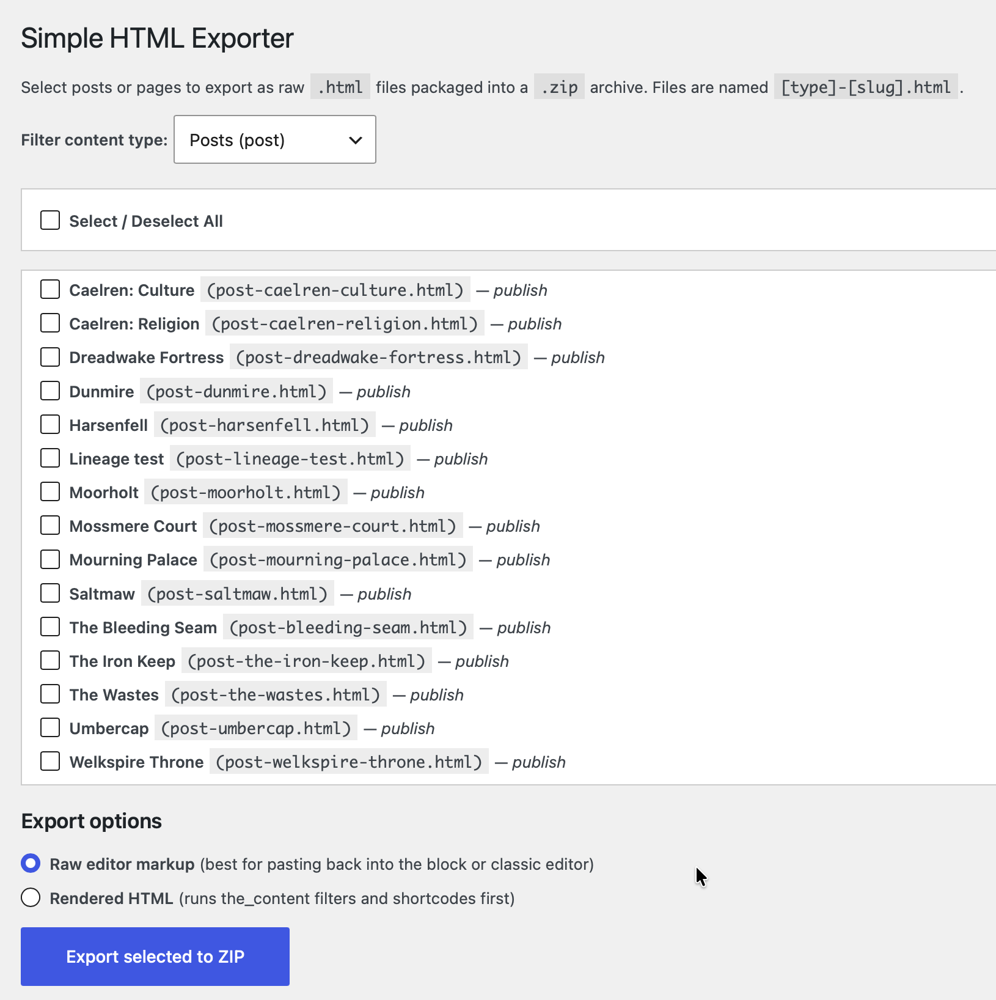

# Simple HTML Exporter

**Version:** 1.1.0
**Author:** Charles Belton (charles@beltoncreative.com)

A WordPress plugin designed to mass or selectively export posts and pages as raw HTML files inside a ZIP package.

## Features

*   The plugin allows you to mass or selectively export posts and pages as HTML files packaged into a `.zip` archive.
*   Content can be filtered by specific post types via a dropdown menu.
*   Users can easily select specific posts from a list or use the master checkbox to select/deselect all items at once.
*   Exported files are automatically named using the `[type]-[slug].html` format.
*   You can choose to export using "Raw editor markup", which is noted as the best option for pasting content back into the block or classic editor.
*   You can choose to export as "Rendered HTML", which processes shortcodes and runs `the_content` filters before exporting.
*   Each exported `.html` file includes an HTML comment header at the top detailing the post's Title, ID, Slug, and Type.

## Server & User Requirements

*   **Permissions:** The user must have `manage_options` capabilities (typically Administrator level) to access the plugin and trigger the download.
*   **PHP:** The web server must have the PHP `ZipArchive` extension enabled to create the `.zip` file.

## Installation

Since this plugin is hosted on GitHub, you can install it by downloading the release archive:

1. Go to the **Releases** section on the right side of this repository's GitHub page.
2. Download the `.zip` file for the latest version (e.g., `simple-html-exporter.zip`).
3. Log in to your WordPress admin dashboard.
4. Navigate to **Plugins** > **Add New Plugin**.
5. Click the **Upload Plugin** button at the top of the screen.
6. Select the `.zip` file you just downloaded and click **Install Now**.
7. Once the installation is complete, click **Activate** to enable the Simple HTML Exporter.

## How to Use

1.  Navigate to the **Tools** section in your WordPress admin dashboard and click on **HTML Exporter**.
2.  Use the dropdown to filter your content type (e.g., page, post, or custom types).
3.  Check the boxes next to the posts you wish to export, or use the "Select / Deselect All" toggle.
4.  Choose your desired export mode: **Raw editor markup** or **Rendered HTML**.
5.  Click the **Export selected to ZIP** button to generate and download your archive.
